[](https://discord.gg/YyutMfPNp4)
[](https://www.curseforge.com/minecraft/mc-mods/sortcraft)
[](https://modrinth.com/mod/sortcraft)

[](https://fabricmc.net/)
[](https://neoforged.net/)

# Sortcraft

**Sortcraft** is a multi-chest item sorter without the redstone. Label chests with signs like `[ores]` or `[tools]`, right-click your input chest, and items instantly sort themselves. Categories live in simple YAML files you control.

---

## 📦 How It Works

```mermaid
flowchart TB
    subgraph FILES["📁 CONFIG FILES"]
        direction TB
        subgraph YAML["config/sortcraft/categories/basic.yaml"]
            C1["<div style='text-align:left'>ores:<br>&nbsp;&nbsp;items:<br>&nbsp;&nbsp;&nbsp;&nbsp;- minecraft:diamond<br>&nbsp;&nbsp;&nbsp;&nbsp;- minecraft:iron_ingot</div>"]
        end
    end

    subgraph GAME["🎮 IN MINECRAFT"]
        direction TB
        INPUT["[input] chest<br><br>contains:<br>diamond, cobblestone"]
        CLICK(["⚡ Right-click sign"])
        D1["[ores] chest"]
        INPUT --> CLICK
        CLICK -->|"diamond matches 'ores:'<br>moves to [ores] chest"| D1
        CLICK -.->|"cobblestone stays<br>(no matching category)"| INPUT
    end

    FILES -.->|"'ores:' in config → [ores] on sign"| GAME

    style C1 fill:#222,stroke:#fff,color:#fff
    style FILES fill:#1a2a1a,stroke:#4a4,color:#cfc
    style YAML fill:#2d4a27,stroke:#6b6,color:#fff
    style GAME fill:#1a2a3c,stroke:#48c,color:#cef
    style CLICK fill:#4a3a1a,stroke:#ca6,color:#fed
    style INPUT fill:#3a3a5c,stroke:#88a,color:#eef
```



You define categories in YAML config files. Sign text must match your category names. That's it!

### What It Looks Like In-Game

| Input Chest | Destination Chest |
|:-----------:|:-----------------:|
|  |  |
| Place `[input]` sign on your source chest | Place `[ores]` sign (or any category) on destination |

Right click the `[input]` sign to sort. All destination chests must be within a configurable search radius of the input chest (default 64 blocks).

---

## 🚀 5-Minute Quick Start

### 1. Create a category file

Create `config/sortcraft/categories/basic.yaml`:

```yaml
ores:
  items:
    - minecraft:diamond
    - minecraft:iron_ingot
    - minecraft:gold_ingot
    - minecraft:copper_ingot
```

OR look at the following examples:
* [Concise Example / Quick Reference](example_categories_consise.yaml)
* [Full Example / What I use on my server](example_categories_full.yaml)

### 2. Build your storage

- Place a chest and attach a sign with `[input]` on any line
- Place another chest and attach a sign with `[ores]` on any line

### 3. Sort!

Put diamonds, iron, gold, or copper in the input chest, then **right-click the `[input]` sign**. Items matching your `ores:` category move to the `[ores]` chest.

---

## 📚 Documentation

| Guide | Description |
|-------|-------------|
| [Commands](docs/COMMANDS.md) | All `/sort` commands |
| [Configuration](docs/CONFIGURATION.md) | YAML syntax, priorities, includes, item tags |
| ↳ [Concise Example](example_categories_consise.yaml) | Quick reference |
| ↳ [Full Example](example_categories_full.yaml) | What I use on my server|
| [Filters](docs/FILTERS.md) | Sort by enchantments, durability, custom names |
| [Regex Patterns](docs/REGEX.md) | Match items with patterns like `/.*:.*_sword/` |
| [Core Concepts](docs/CONCEPTS.md) | Priority system, category inheritance, stacking |
| [Troubleshooting](docs/TROUBLESHOOTING.md) | Common issues and solutions |
| [Audit Logging](docs/AUDIT_LOGGING.md) | Server admin logging features |

---

## 🔧 Development & Building

Sortcraft supports Minecraft **1.21.1, 1.21.4–1.21.10** on both Fabric and NeoForge.

```powershell
.\build-all-versions.ps1
```

Built JARs are placed in `build/libs/all-versions/`.

See [Dependency Metadata URLs](#dependency-version-metadata-urls) for version updates.

---

<details>
<summary><strong>Dependency Version Metadata URLs (for developer reference)</strong></summary>

| Dependency             | Metadata URL                                                                       |
|------------------------|------------------------------------------------------------------------------------|
| **Fabric API**         | `https://maven.fabricmc.net/net/fabricmc/fabric-api/fabric-api/maven-metadata.xml` |
| **Fabric Loader**      | `https://meta.fabricmc.net/v2/versions/loader`                                     |
| **Fabric Yarn**        | `https://meta.fabricmc.net/v2/versions/yarn/{mc_version}`                          |
| **NeoForge**           | `https://maven.neoforged.net/api/maven/versions/releases/net/neoforged/neoforge`   |
| **Architectury API**   | `https://maven.architectury.dev/dev/architectury/architectury/maven-metadata.xml`  |
| **Minecraft Versions** | `https://piston-meta.mojang.com/mc/game/version_manifest_v2.json`                  |

</details>
