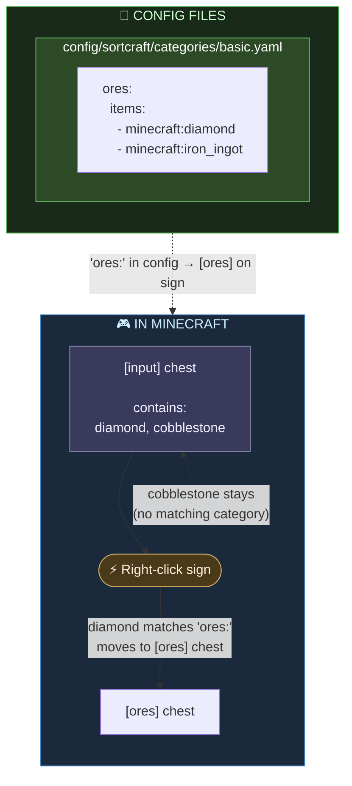
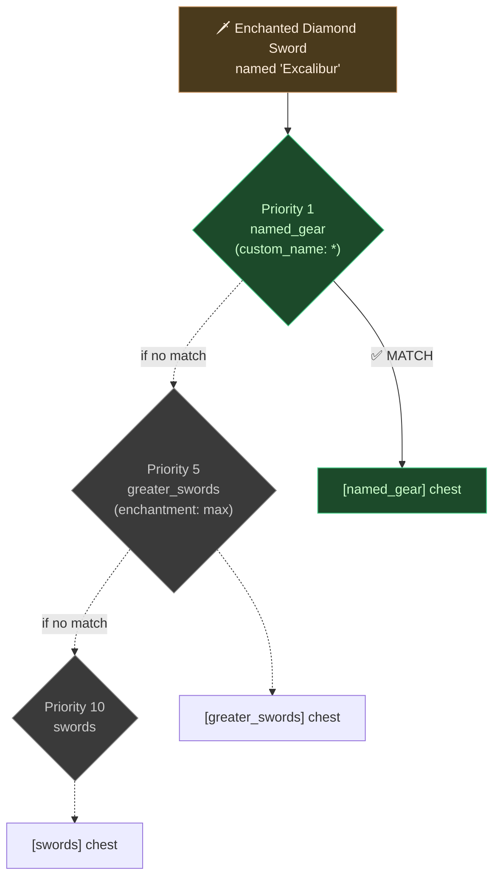
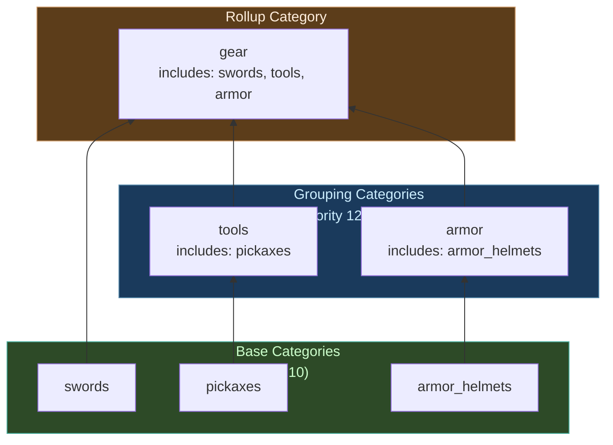
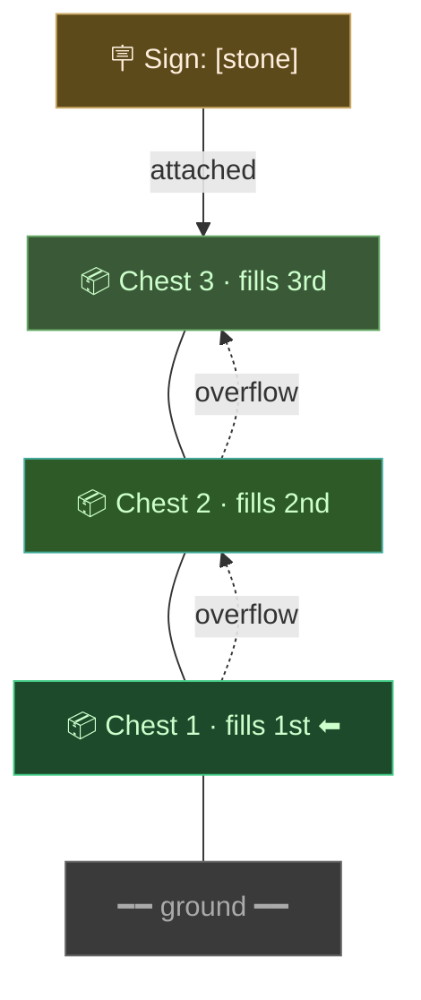

# Core Concepts

This guide explains the key mental models for understanding how SortCraft works.

---

## The Sorting Flow


```mermaid
flowchart TB
    subgraph FILES["📁 CONFIG FILES"]
        direction TB
        subgraph YAML["config/sortcraft/categories/basic.yaml"]
            C1["<div style='text-align:left'>ores:<br>&nbsp;&nbsp;items:<br>&nbsp;&nbsp;&nbsp;&nbsp;- minecraft:diamond<br>&nbsp;&nbsp;&nbsp;&nbsp;- minecraft:iron_ingot</div>"]
        end
    end

    subgraph GAME["🎮 IN MINECRAFT"]
        direction TB
        INPUT["[input] chest<br><br>contains:<br>diamond, cobblestone"]
        CLICK(["⚡ Right-click sign"])
        D1["[ores] chest"]
        INPUT --> CLICK
        CLICK -->|"diamond matches 'ores:'<br>moves to [ores] chest"| D1
        CLICK -.->|"cobblestone stays<br>(no matching category)"| INPUT
    end

    FILES -.->|"'ores:' in config → [ores] on sign"| GAME

    style FILES fill:#1a2a1a,stroke:#4a4,color:#cfc
    style YAML fill:#2d4a27,stroke:#6b6,color:#fff
    style GAME fill:#1a2a3c,stroke:#48c,color:#cef
    style CLICK fill:#4a3a1a,stroke:#ca6,color:#fed
    style INPUT fill:#3a3a5c,stroke:#88a,color:#eef
```

**Key insight:** You define category names in your YAML files. Signs in-game must use those exact names in square brackets.

---

## Priority System: First Match Wins

Categories are checked in priority order. **Lower number = checked first.** Once an item matches, it stops checking.


```mermaid
flowchart TD
    ITEM["🗡️ Enchanted Diamond Sword<br>named 'Excalibur'"]

    P1{"Priority 1<br>named_gear<br>(custom_name: *)"}
    P5{"Priority 5<br>greater_swords<br>(enchantment: max)"}
    P10{"Priority 10<br>swords"}

    C1["[named_gear] chest"]
    C5["[greater_swords] chest"]
    C10["[swords] chest"]

    ITEM --> P1
    P1 -->|"✅ MATCH"| C1
    P1 -.->|"if no match"| P5
    P5 -.->|"if no match"| P10
    P5 -.-> C5
    P10 -.-> C10

    style ITEM fill:#4a3a1c,stroke:#c96,color:#fed
    style P1 fill:#1c4a2a,stroke:#4c8,color:#cfc
    style C1 fill:#1c4a2a,stroke:#4c8,color:#cfc
    style P5 fill:#3a3a3a,stroke:#888,color:#ccc
    style P10 fill:#3a3a3a,stroke:#888,color:#ccc
```

The sword is renamed, so it matches `named_gear` (priority 1) and goes there—even though it would also match `greater_swords` and `swords`.

### Recommended Priority Values

| Priority | Use Case |
|----------|----------|
| 1-4 | Special items (named, specific enchantments) |
| 5 | "Greater" enchanted items (max-level) |
| 10 | Default (most categories) |
| 12 | Grouping categories (gear, tools) |
| 20 | Rollup/catch-all categories |

---

## Category Inheritance with `includes`

Use `includes` to build category hierarchies. Parent categories inherit items from their children.


```mermaid
flowchart BT
    subgraph BASE["Base Categories<br>(Priority 10)"]
        SWORDS["swords"]
        PICKAXES["pickaxes"]
        HELMETS["armor_helmets"]
    end

    subgraph MID["Grouping Categories<br>(Priority 12)"]
        TOOLS["tools<br>includes: pickaxes"]
        ARMOR["armor<br>includes: armor_helmets"]
    end

    subgraph TOP["Rollup Category<br>(Priority 15)"]
        GEAR["gear<br>includes: swords, tools, armor"]
    end

    SWORDS --> GEAR
    PICKAXES --> TOOLS
    HELMETS --> ARMOR
    TOOLS --> GEAR
    ARMOR --> GEAR

    style BASE fill:#2d4a27,stroke:#4a9,color:#cfc
    style MID fill:#1a3a5c,stroke:#58a,color:#cef
    style TOP fill:#5c3d1a,stroke:#c96,color:#fed
```

**How it works:**
- A diamond sword matches `swords` (priority 10) → goes to `[swords]` chest
- If no `[swords]` chest exists, it matches `gear` (priority 15) → goes to `[gear]` chest
- The `gear` category acts as a catch-all for weapons, tools, and armor

**Why this priority order?** In this example, base categories have lower priority numbers so they're checked first. This lets you use specific chests (`[swords]`) when you have room, with `[gear]` as a fallback. You could reverse the priorities if you prefer consolidation over specificity.

### Example Configuration

The categories shown in the diagrams above:

```yaml
# Base categories (default priority 10)
swords:
  items:
  - /.*:.*_sword/

pickaxes:
  items:
  - /.*:.*_pickaxe/

armor_helmets:
  items:
  - /.*:.*_helmet/

# Grouping categories
tools:
  priority: 12
  includes:
  - pickaxes

armor:
  priority: 12
  includes:
  - armor_helmets

# Rollup category
gear:
  priority: 15
  includes:
  - swords
  - tools
  - armor

# Filter-based categories (from priority diagram)
greater_swords:
  priority: 5
  filters:
  - enchantment: max
  includes:
  - swords

named_gear:
  priority: 1
  filters:
  - custom_name: '*'
  includes:
  - gear
```

---

## Stacked Chests Fill Bottom-Up

Place a sign on top of a vertical stack of chests. All chests below the sign (until another category sign is reached) are treated as one storage unit, filling from bottom to top.


```mermaid
flowchart TB
    SIGN["🪧 Sign: [stone]"]
    C3["📦 Chest 3 · fills 3rd"]
    C2["📦 Chest 2 · fills 2nd"]
    C1["📦 Chest 1 · fills 1st ⬅"]
    GND["━━ ground ━━"]

    SIGN -->|"attached"| C3
    C3 --- C2 --- C1 --- GND

    C1 -.->|"overflow"| C2
    C2 -.->|"overflow"| C3

    style SIGN fill:#5c4a1a,stroke:#ca6,color:#fed
    style C3 fill:#3a5a37,stroke:#6a6,color:#cfc
    style C2 fill:#2d5a27,stroke:#4a9,color:#cfc
    style C1 fill:#1c4a2a,stroke:#4c8,color:#cfc
    style GND fill:#3a3a3a,stroke:#666,color:#aaa
```

**Key points:**
- The sign sits on top of the stack (attached to the top chest)
- Items fill the **lowest chest first**, then overflow upward
- The stack ends when it hits another category sign or runs out of chests
- This lets you build vertical storage towers that expand naturally

---

## Input Chest Stacking

Just like destination chests, you can stack multiple `[input]` chests vertically. When you right-click the sign or use `/sort input`, all chests in the stack are sorted at once.

This is useful when you have large amounts of items to sort—just dump everything into a column of input chests and trigger a single sort operation.

---

## Container Sorting (Bundles & Shulker Boxes)

When the sorting engine encounters a **bundle** or **shulker box** in the input chest, it automatically sorts the items *inside* it — not the container itself. Each item inside the bundle or shulker box is matched against your categories and moved to the appropriate destination chest individually.

Items that are successfully sorted are removed from the container. Any items that can't be sorted (no matching category, destination full) remain inside it. If the container is fully emptied, it will get sorted too; otherwise, it's left in the input chest.

---

## Modded Storage Support

SortCraft works with modded storage blocks as both **input** and **destination** chests. Any block that exposes a storage API can be used — label it with an `[input]` sign to sort from it, or a category sign to sort into it:

- **Fabric:** Blocks exposing a `Storage<ItemVariant>` via the Transfer API (e.g., Storage Drawers)
- **NeoForge:** Blocks exposing an `IItemHandler` capability (e.g., Sophisticated Storage)

---

## Three Ways to Match Items

| Method | Syntax | Best For |
|--------|--------|----------|
| **Explicit ID** | `minecraft:diamond_sword` | Specific single items |
| **Tags** | `#minecraft:logs` | Vanilla item groups |
| **Regex** | `/.*:.*_sword/` | Mod support, bulk matching |

All three can be combined in a single category:

```yaml
weapons:
  items:
  - minecraft:trident           # Explicit
  - "#minecraft:axes"           # Tag
  - /.*:.*_sword/               # Regex
```

---

## See Also

- [Configuration](CONFIGURATION.md) - YAML syntax reference
- [Filters](FILTERS.md) - Match by enchantments, durability, etc.
- [Troubleshooting](TROUBLESHOOTING.md) - Common issues

