# Core Concepts

This guide explains the key mental models for understanding how Sortcraft works.

---

## The Sorting Flow


**Key insight:** You define category names in your YAML files. Signs in-game must use those exact names in square brackets.

---

## Priority System: First Match Wins

Categories are checked in priority order. **Lower number = checked first.** Once an item matches, it stops checking.


The sword is renamed, so it matches `named_gear` (priority 1) and goes there—even though it would also match `greater_swords` and `swords`.

### Recommended Priority Values

| Priority | Use Case |
|----------|----------|
| 1-4 | Special items (named, specific enchantments) |
| 5 | "Greater" enchanted items (max-level) |
| 10 | Default (most categories) |
| 12 | Grouping categories (gear, tools) |
| 20 | Rollup/catch-all categories |

---

## Category Inheritance with `includes`

Use `includes` to build category hierarchies. Parent categories inherit items from their children.


**How it works:**
- A diamond sword matches `swords` (priority 10) → goes to `[swords]` chest
- If no `[swords]` chest exists, it matches `gear` (priority 15) → goes to `[gear]` chest
- The `gear` category acts as a catch-all for weapons, tools, and armor

**Why this priority order?** In this example, base categories have lower priority numbers so they're checked first. This lets you use specific chests (`[swords]`) when you have room, with `[gear]` as a fallback. You could reverse the priorities if you prefer consolidation over specificity.

### Example Configuration

The categories shown in the diagrams above:

```yaml
# Base categories (default priority 10)
swords:
  items:
  - /.*:.*_sword/

pickaxes:
  items:
  - /.*:.*_pickaxe/

armor_helmets:
  items:
  - /.*:.*_helmet/

# Grouping categories
tools:
  priority: 12
  includes:
  - pickaxes

armor:
  priority: 12
  includes:
  - armor_helmets

# Rollup category
gear:
  priority: 15
  includes:
  - swords
  - tools
  - armor

# Filter-based categories (from priority diagram)
greater_swords:
  priority: 5
  filters:
  - enchantment: max
  includes:
  - swords

named_gear:
  priority: 1
  filters:
  - custom_name: '*'
  includes:
  - gear
```

---

## Stacked Chests Fill Bottom-Up

Place a sign on top of a vertical stack of chests. All chests below the sign (until another category sign is reached) are treated as one storage unit, filling from bottom to top.

```mermaid
flowchart TB
    SIGN["🪧 Sign: [stone]"]
    C3["📦 Chest 3 · fills 3rd"]
    C2["📦 Chest 2 · fills 2nd"]
    C1["📦 Chest 1 · fills 1st ⬅"]
    GND["━━ ground ━━"]

    SIGN -->|"attached"| C3
    C3 --- C2 --- C1 --- GND

    C1 -.->|"overflow"| C2
    C2 -.->|"overflow"| C3

    style SIGN fill:#5c4a1a,stroke:#ca6,color:#fed
    style C3 fill:#3a5a37,stroke:#6a6,color:#cfc
    style C2 fill:#2d5a27,stroke:#4a9,color:#cfc
    style C1 fill:#1c4a2a,stroke:#4c8,color:#cfc
    style GND fill:#3a3a3a,stroke:#666,color:#aaa
```



**Key points:**
- The sign sits on top of the stack (attached to the top chest)
- Items fill the **lowest chest first**, then overflow upward
- The stack ends when it hits another category sign or runs out of chests
- This lets you build vertical storage towers that expand naturally

---

## Three Ways to Match Items

| Method | Syntax | Best For |
|--------|--------|----------|
| **Explicit ID** | `minecraft:diamond_sword` | Specific single items |
| **Tags** | `#minecraft:logs` | Vanilla item groups |
| **Regex** | `/.*:.*_sword/` | Mod support, bulk matching |

All three can be combined in a single category:

```yaml
weapons:
  items:
  - minecraft:trident           # Explicit
  - "#minecraft:axes"           # Tag
  - /.*:.*_sword/               # Regex
```

---

## See Also

- [Configuration](CONFIGURATION.md) - YAML syntax reference
- [Filters](FILTERS.md) - Match by enchantments, durability, etc.
- [Troubleshooting](TROUBLESHOOTING.md) - Common issues

