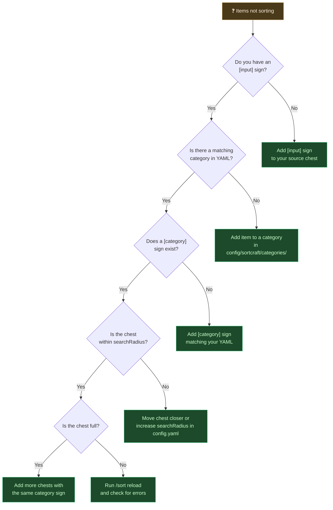

# Troubleshooting

Use this guide to diagnose common Sortcraft issues.

---

## Quick Diagnostic Decision Tree



---

## Common Issues

### Items Stay in Input Chest

**Symptoms:** Items don't move when you right-click the `[input]` sign.

**Checklist:**
1. ✅ Is the item in a category? Use `/sort category <item_id>` to check
2. ✅ Does a sign with `[category_name]` exist? Must match YAML exactly
3. ✅ Is the destination chest within search radius? Default is 64 blocks
4. ✅ Is there space in the destination chest?

**Quick fix:** Run `/sort preview` to see what would sort and where.

---

### Category Sign Not Recognized

**Symptoms:** Items skip a chest even though it has a sign.

**Causes:**
- Sign text doesn't match YAML category name (case-sensitive!)
- Sign missing square brackets

**Fix:** Sign must have `[category_name]` where `category_name` exactly matches your YAML:

```yaml
# In YAML:
ores:
  items: ...
```

```
# On sign:
[ores]
```

---

### Wrong Priority Order

**Symptoms:** Items go to general categories instead of specific ones.

**Example:** Enchanted swords go to `[gear]` instead of `[greater_swords]`.

**Cause:** Your specific category has higher priority number than the general one.

**Fix:** Lower priority = checked first. Ensure:
```yaml
greater_swords:
  priority: 5      # ← Lower, checked first
  filters:
  - enchantment: max

gear:
  priority: 12     # ← Higher, checked later
```

---

### Config Not Loading

**Symptoms:** Changes to YAML files don't take effect.

**Fix:**
1. Run `/sort reload`
2. Check game log for YAML syntax errors
3. Validate YAML at [yamllint.com](https://www.yamllint.com/)

**Common YAML errors:**
- Tabs instead of spaces
- Missing colons after category names
- Incorrect indentation

---

### Regex Pattern Not Matching

**Symptoms:** Items that should match a pattern don't sort.

**Debug steps:**
1. Use `/sort category minecraft:item_name` to see which categories match
2. Remember patterns match **anywhere** in the ID by default
3. Check you're using `/pattern/` syntax (not just `pattern`)

**Common mistakes:**
```yaml
# Wrong - missing slashes
items:
- .*:.*_sword

# Correct
items:
- /.*:.*_sword/
```

---

## Useful Commands for Debugging

| Command | Use |
|---------|-----|
| `/sort preview` | See what would sort without moving items |
| `/sort category <item>` | Check which categories match an item |
| `/sort whereis <item>` | Find where an item is currently stored |
| `/sort diagnostics` | Generate full storage report |
| `/sort dump` | Export all item tags to JSON |
| `/sort reload` | Reload config and see errors |

---

## Enable Debug Logging

For detailed troubleshooting, enable debug logging:

```yaml
# config/sortcraft/config.yaml
logLevel: DEBUG
```

Then check game logs for detailed sorting decisions.

---

## Still Stuck?

1. Check the [Discord](https://discord.gg/YyutMfPNp4) for help
2. Run `/sort diagnostics` and share the output
3. Share your category YAML files

